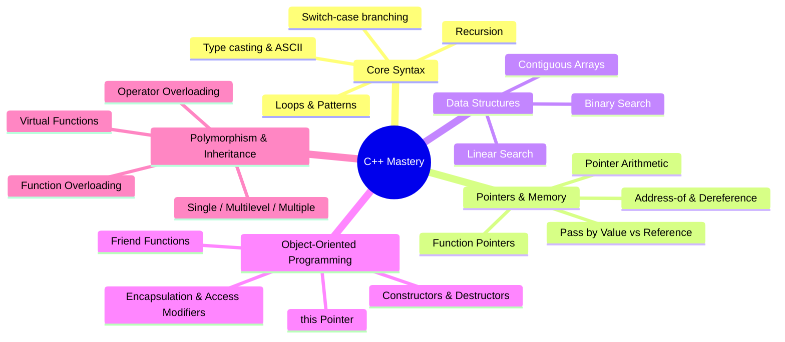

# 🚀 Learning C++: From Fundamentals to Advanced OOP & DSA

[](https://isocpp.org/)
[](.)
[](.)
[](.)

Welcome to **Learning-CPP**! This repository is a structured collection of **68 C++ programs** tracking a hands-on progression through modern C++, starting from basic syntax and algorithmic control structures to advanced Object-Oriented Programming (OOP), memory management with pointers, operator overloading, and real-world console applications.

---

## 📑 Table of Contents

- [Overview](#-overview)
- [Comprehensive Program Catalog](#-comprehensive-program-catalog)
  - [1. Core Fundamentals & Conditional Logic](#1-core-fundamentals--conditional-logic-15-programs)
  - [2. Loops, Patterns & Mathematical Algorithms](#2-loops-patterns--mathematical-algorithms-9-programs)
  - [3. Functions, References & Pointers](#3-functions-references--pointers-5-programs)
  - [4. Arrays & Searching Algorithms](#4-arrays--searching-algorithms-8-programs)
  - [5. Object-Oriented Programming (Classes & Encapsulation)](#5-object-oriented-programming-classes--encapsulation-9-programs)
  - [6. Object Lifecycle (Constructors, Destructor & `this` Pointer)](#6-object-lifecycle-constructors-destructor--this-pointer-4-programs)
  - [7. Polymorphism, Overloading & Friend Functions](#7-polymorphism-overloading--friend-functions-10-programs)
  - [8. Inheritance Hierarchies](#8-inheritance-hierarchies-3-programs)
  - [9. Real-World Applications & Interactive CLI Tools](#9-real-world-applications--interactive-cli-tools-1-program)
  - [10. Experimental & Practice Stubs](#10-experimental--practice-stubs-4-programs)
- [Key C++ Concepts Mastered](#-key-c-concepts-mastered)
- [How to Build & Run](#-how-to-build--run)

---

## 💡 Overview

Every program in this repository addresses a specific concept or algorithmic challenge:
- **Foundational Control Flow**: Decision-making structures (`if-else`, ternary, switch-case), character validation, and nested conditions.
- **Mathematical Computation & Recursion**: Factorials, Fibonacci sequences, prime number generators, Armstrong numbers, and palindrome checks.
- **Memory Mechanics**: Memory addresses, pointer arithmetic, pass-by-value vs. pass-by-reference semantics, and function pointers.
- **Data Structures**: Array transformations, dynamic bounds, linear search, and binary search $O(\log n)$.
- **Object-Oriented Architecture**: Data encapsulation, constructor overloading, destructor cleanup, unary & binary operator overloading (`+`, `--`, `++`, `<`), friend functions, and dynamic polymorphism with `virtual` methods.

---

## 📂 Comprehensive Program Catalog

### 1. Core Fundamentals & Conditional Logic (15 programs)

Programs demonstrating input/output streams (`cin`/`cout`), relational and logical operators, branching statements, and multi-way decision switches.

| File | Concept | Description |
| :--- | :--- | :--- |
| [`main.cpp`](main.cpp) | Environment / Sanity Check | Introductory program verifying toolchain, standard I/O streams, and Git integration. |
| [`vote.cpp`](vote.cpp) | Basic Conditional Branching | Evaluates citizen age against the legal voting threshold ($\ge 18$). |
| [`leap.cpp`](leap.cpp) | Modulo Arithmetic & Logic | Determines whether an input calendar year is a leap year. |
| [`oddeven.cpp`](oddeven.cpp) | Parity Testing | Analyzes integers using the modulo operator (`% 2`) to identify even or odd numbers. |
| [`score.cpp`](score.cpp) | Multi-tier Range Evaluation | Implements an academic grading scale (Grades A, B, C, Fail) via chained `if-else` blocks. |
| [`pass.cpp`](pass.cpp) | Boolean Validation | Validates student marks against a minimum pass benchmark. |
| [`old.cpp`](old.cpp) | Comparative Evaluation | Compares two user ages to determine the older individual. |
| [`largest.cpp`](largest.cpp) | Maximum of Three Values | Identifies the greatest of three input numbers using chained relational comparisons. |
| [`smallest.cpp`](smallest.cpp) | Minimum of Three Values | Identifies the lowest value among three integers using compound boolean expressions. |
| [`largest_smallest.cpp`](largest_smallest.cpp) | Dual Extreme Extraction | Computes both the maximum and minimum values simultaneously from a 3-element set. |
| [`upperandlower.cpp`](upperandlower.cpp) | ASCII & Character Categorization | Identifies whether an input character is uppercase (`'A'-'Z'`) or lowercase (`'a'-'z'`). |
| [`VowelConsonant.cpp`](VowelConsonant.cpp) | Character Selection | Evaluates if an alphabet character is a vowel (`a, e, i, o, u`) or a consonant. |
| [`calc.cpp`](calc.cpp) | Menu-driven Arithmetic | Interactive command-line calculator utilizing `switch-case` for operations (`+`, `-`, `*`, `/`). |
| [`week.cpp`](week.cpp) | Discrete State Mapping | Maps day indices (`1`–`7`) to their corresponding weekday strings using `switch-case`. |
| [`MonthName.cpp`](MonthName.cpp) | Calendar Logic & Validation | Maps integers (`1`–`12`) to month names and displays the exact count of days (including leap year checks for February). |

---

### 2. Loops, Patterns & Mathematical Algorithms (9 programs)

Programs utilizing iteration constructs (`for`, `while`, `do-while`), nested loops for geometric patterns, and recursive algorithm formulations.

| File | Concept | Description |
| :--- | :--- | :--- |
| [`table.cpp`](table.cpp) | Fixed Iteration (`for` loop) | Generates and formats a complete mathematical multiplication table for any input integer. |
| [`sumevenodd.cpp`](sumevenodd.cpp) | Accumulator Pattern | Iterates through a numerical sequence, independently accumulating sums of even and odd values. |
| [`factorial.cpp`](factorial.cpp) | Direct Recursion | Computes the factorial of non-negative integers ($n!$) using recursive function calls with base-case guards. |
| [`Fibonacci.cpp`](Fibonacci.cpp) | Recursive State Transitions | Solves for the $n$-th Fibonacci sequence number using recursive reduction ($F_n = F_{n-1} + F_{n-2}$). |
| [`prime.cpp`](prime.cpp) | Primality Testing & Sieve Basics | Finds and outputs all prime numbers in the interval $[1, n]$ by testing divisibility. |
| [`Armstrong.cpp`](Armstrong.cpp) | Number Digit Decomposition | Decomposes numbers digit-by-digit to verify if the sum of cubes of digits equals the original number. |
| [`Palindrome.cpp`](Palindrome.cpp) | Mathematical Digit Reversal | Reverses integer digits mathematically via `% 10` and `/ 10` to detect numerical symmetry. |
| [`starsq.cpp`](starsq.cpp) | Nested Loops (Square Matrix) | Renders square star patterns and hollow geometric squares using coordinated 2D loops. |
| [`startriangle.cpp`](startriangle.cpp) | Nested Loops (Triangular Patterns) | Implements right-angled triangles, inverted pyramids, and numeric patterns using dynamic loop constraints. |

---

### 3. Functions, References & Pointers (5 programs)

Programs exploring parameter passing conventions, low-level memory inspection, dereferencing, and runtime dynamic dispatch through function pointers.

| File | Concept | Description |
| :--- | :--- | :--- |
| [`functioncalculator.cpp`](functioncalculator.cpp) | Modular Functional Design | Disaggregates arithmetic logic into standalone functions (`add`, `subtract`, `multiply`, `divide`). |
| [`swap.cpp`](swap.cpp) | Parameter Passing Semantics | Contrasts pass-by-value vs pass-by-reference (`&a, &b`) and illustrates memory swapping techniques. |
| [`double.cpp`](double.cpp) | Reference Side-Effects | Demonstrates in-place mutation of caller variables using C++ reference parameters. |
| [`pointer.cpp`](pointer.cpp) | Pointer Fundamentals | Inspects memory layout using the address-of operator (`&`) and value modification via dereferencing (`*`). |
| [`pointerfunction.cpp`](pointerfunction.cpp) | Function Pointers | Dispatches arithmetic operations dynamically at runtime using function pointer signatures `int (*operation)(int, int)`. |

---

### 4. Arrays & Searching Algorithms (8 programs)

Linear data structures, indexed buffer manipulation, pointer arithmetic, and foundational searching algorithms.

| File | Concept | Description |
| :--- | :--- | :--- |
| [`array.cpp`](array.cpp) | Array Allocation & Traversal | Demonstrates static contiguous memory allocation, user population, and index-based iteration. |
| [`arraypointer.cpp`](arraypointer.cpp) | Pointer Arithmetic with Arrays | Accesses and steps through contiguous array elements using pointer increments (`*(ptr + i)`). |
| [`sumarray.cpp`](sumarray.cpp) | Array Aggregation | Accumulates the total sum of elements across a statically defined numeric array. |
| [`sumofarray.cpp`](sumofarray.cpp) | Modular Array Processing | Separates array logic into decoupled functions: `insert()`, `display()`, and `sum()`. |
| [`smallestlargestarray.cpp`](smallestlargestarray.cpp) | Array Min/Max Discovery | Implements $O(n)$ scanning passes to locate both the minimum and maximum elements in an array. |
| [`linear.cpp`](linear.cpp) | Basic Linear Search | Iterates sequentially through an array to find target elements. |
| [`linear1.cpp`](linear1.cpp) | Modular Linear Search | Encapsulates linear search inside a reusable function returning the matched element's 0-based index or `-1`. |
| [`binary.cpp`](binary.cpp) | Binary Search $O(\log n)$ | Implements divide-and-conquer binary search with midpoint calculation `m = l + (r - l) / 2` over sorted sequences. |

---

### 5. Object-Oriented Programming (Classes & Encapsulation) (9 programs)

Programs showcasing entity modeling, state protection (`private`/`public` access specifiers), member functions, and arrays of objects.

| File | Class / Entity | Description |
| :--- | :--- | :--- |
| [`area.cpp`](area.cpp) | `rectangle` | Models rectangle dimensions with private fields, using a `friend` function for area calculation. |
| [`BANK.cpp`](BANK.cpp) | `bank` | Simulates a banking registry managing an array of customer accounts (`accountHolderName`, `accountNumber`, `balance`). |
| [`Bank1.cpp`](Bank1.cpp) | `Account` | Encapsulates bank balance state and combines balances across accounts using operator overloading. |
| [`BankAccount.cpp`](BankAccount.cpp) | `BankAccount` | Implements robust account modeling with dual constructors (default & parameterized) and formatted records. |
| [`classStudent.cpp`](classStudent.cpp) | `Student` | Models academic profiles with `inputDetails()` and `displayDetails()` member functions. |
| [`student.cpp`](student.cpp) | `student` | Manages an array of 5 student objects, recording marks and running an algorithm to find the class topper. |
| [`marks.cpp`](marks.cpp) | `student` | Multi-field student entity tracking class, roll number, and marks with tabular record printing. |
| [`employee.cpp`](employee.cpp) | `employee` | Models corporate payroll, automatically computing annual compensation from monthly salary inputs. |
| [`laptop.cpp`](laptop.cpp) | `Laptop` | Encapsulates computer hardware specifications (`brand`, `model`, `price`) with parameterized initialization. |

---

### 6. Object Lifecycle (Constructors, Destructor & `this` Pointer) (4 programs)

Covers object construction, initialization lists, the `this` pointer for self-reference, and deterministic destruction.

| File | Primary Classes | Description |
| :--- | :--- | :--- |
| [`constructor.cpp`](constructor.cpp) | `Rishabh` | Illustrates default constructor invocation automatically when an object instance is created. |
| [`paracons.cpp`](paracons.cpp) | `bankholder` | Demonstrates explicit parameter injection during instantiation via a parameterized constructor. |
| [`parameterconstructor.cpp`](parameterconstructor.cpp) | `AreaCalculator` | Constructor overloading: dynamically initializes geometry calculations for rectangles, circles, or squares depending on argument arity. |
| [`Const_Dest_this.cpp`](Const_Dest_this.cpp) | `Student` | Complete lifecycle demonstration: default constructor, parameterized constructor with `this->` resolution, copy constructor, and destructor (`~Student`). |

---

### 7. Polymorphism, Overloading & Friend Functions (10 programs)

Compile-time (static) polymorphism via function and operator overloading, private data access via `friend` functions, and runtime (dynamic) polymorphism with `virtual` functions.

| File | Overloading Type | Description |
| :--- | :--- | :--- |
| [`function_overloading.cpp`](function_overloading.cpp) | Function Overloading | Overloads `add()` for distinct parameter types and arity (2 integers vs. 2 integers + 1 float). |
| [`function_overloading1.cpp`](function_overloading1.cpp) | Function Overloading | Overloads `area()` method for calculating geometric areas of circles, rectangles, and squares. |
| [`function_overloading2.cpp`](function_overloading2.cpp) | Function Overloading | Overloads a billing system method `bill()` to calculate prices with optional discounts and tax charges. |
| [`overloading.cpp`](overloading.cpp) | Binary Operator (`+`) | Overloads the binary addition operator `operator+` to combine properties of two user-defined `number` objects. |
| [`student2.cpp`](student2.cpp) | Relational Operator (`<`) | Overloads the comparison operator `operator<` to rank and compare academic marks between two `Student` instances. |
| [`lift_overloading.cpp`](lift_overloading.cpp) | Unary Operators (`++`, `--`) | Simulates elevator floor movement by implementing both prefix and postfix increment and decrement operators. |
| [`complex.cpp`](complex.cpp) | Binary Operator (`+`) | Implements mathematical complex number addition ($a + bi$) by overloading `operator+`. |
| [`complex1.cpp`](complex1.cpp) | Binary Operator (`+`) | Complex number addition using `const &` parameters and returning a new stack-allocated `Complex` instance. |
| [`friend_function.cpp`](friend_function.cpp) | Friend Function | Uses a `friend void show(student obj)` function to access private members (`name`, `roll`, `marks`) from outside class scope. |
| [`runtime_polymorphism.cpp`](runtime_polymorphism.cpp) | Virtual Functions | Demonstrates runtime dynamic dispatch: calls derived class overrides via base class pointer (`base *b = &derivedObj`). |

---

### 8. Inheritance Hierarchies (3 programs)

Code reuse, access propagation, and hierarchical domain modeling across base and derived classes.

| File | Paradigm | Inheritance Diagram | Description |
| :--- | :--- | :--- | :--- |
| [`single.cpp`](single.cpp) | Single Inheritance | `Person` $\rightarrow$ `Student` | Derived `Student` inherits member properties and behaviors from base `Person`. |
| [`multilevel.cpp`](multilevel.cpp) | Multilevel Inheritance | `grandfather` $\rightarrow$ `father` $\rightarrow$ `son` | Demonstrates cascading property and behavior inheritance through three ancestral generations. |
| [`multiple.cpp`](multiple.cpp) | Multiple Inheritance | `device`, `phone` $\rightarrow$ `smartphone` | Derives `smartphone` from multiple distinct parent classes (`phone` and `device`). |

---

### 9. Real-World Applications & Interactive CLI Tools (1 program)

| File | Project Title | Description |
| :--- | :--- | :--- |
| [`tracker.cpp`](tracker.cpp) | **Biomechanics & Performance Tracker** | An interactive command-line application built for athletic monitoring. Features full name ingestion (`getline`), sprint velocity feedback analysis (100m sprint thresholds), plyometric set/volume tracking loops, and state-driven session persistence. |

---

### 10. Experimental & Practice Stubs (4 programs)

Work-in-progress and draft exploration files for upcoming data structure and inheritance modules.

| File | Topic Area | Status |
| :--- | :--- | :--- |
| [`DiamomdProb.cpp`](DiamomdProb.cpp) | Diamond Problem | Scratchpad for virtual base classes in multiple inheritance. |
| [`arr.cpp`](arr.cpp) | Array Exploration | Template stub for array experimentation. |
| [`array1.cpp`](array1.cpp) | Advanced Arrays | Placeholder for dynamic/multi-dimensional array practice. |
| [`st.cpp`](st.cpp) | Structs / Classes | Scratchpad for C++ structures and data records. |

---

## 🧠 Key C++ Concepts Mastered



---

## 🛠️ How to Build & Run

### Prerequisites
Any modern C++ compiler supporting **C++17** or **C++20**:
- **GCC (`g++`)** $\ge 9.0$
- **Clang (`clang++`)** $\ge 10.0$
- **MSVC** (Visual Studio 2019+)

### Compiling Any Program

To compile any program from the terminal using `g++` or `clang++`:

```bash
# General Syntax
g++ -std=c++17 -Wall -Wextra <filename>.cpp -o <output_binary>

# Example 1: Compile the Biomechanics Performance Tracker
g++ -std=c++17 tracker.cpp -o tracker
./tracker

# Example 2: Compile Binary Search Algorithm
g++ -std=c++17 binary.cpp -o binary
./binary

# Example 3: Compile Operator Overloading Demo
g++ -std=c++17 lift_overloading.cpp -o lift_overloading
./lift_overloading
```

### Batch Compilation Check (Optional)
To verify compilation of all functional programs in the directory:

```bash
for file in *.cpp; do
  if [ -s "$file" ]; then
    g++ -std=c++17 -fsyntax-only "$file" 2>/dev/null && echo "✅ $file compiles" || echo "⚠️  $file needs review"
  fi
done
```

---

## 👤 Author

- **Rishabh Dev** ([@RishabhDev817](https://github.com/RishabhDev817))
- Dedicated to building a solid foundation in low-level systems programming, algorithms, and software design patterns.
